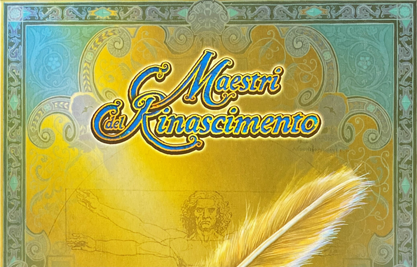

# Prova Finale Ingegneria del Sofware 2020/21



## Sviluppatori

[Valeria Detomas](https://github.com/valeriadetomas)

[Mauro Famà](https://github.com/maurofama99)

[Christian Fabio Grazian](https://github.com/grazcri)

## Funzionalità implementate

* Regole complete
* CLI + GUI
* Socket
* __2 Funzionalità avanzate__
    * Partite multiple
    * Partita locale

## Istruzioni per l'esecuzione

### Server
Per lanciare il server di Maestri del Rinascimento, posizionarsi nella directory /deliverables/final/jar e lanciare da terminale il seguente comando:
```bash
java -jar server.jar -port portNumber
```
In cui portNumber indica la porta in cui il server si metterà in ascolto.

### Client
Per lanciare il client di Maestri del Rinascimento posizionarsi nella directory /deliverables/final/jar e, a seconda della modalità di gioco desiderata, lanciare da terminale uno dei seguenti comandi:
#### CLI 
```bash
java -jar client.jar -cli -port portNumber
```
In cui portNumber indica la porta alla quale si connetterà il client
#### GUI
```bash
java -jar client.jar -gui
```
#### Partita locale
##### CLI
```bash
java -jar client.jar -local -cli
```
##### GUI
```bash
java -jar client.jar -local -gui
```


